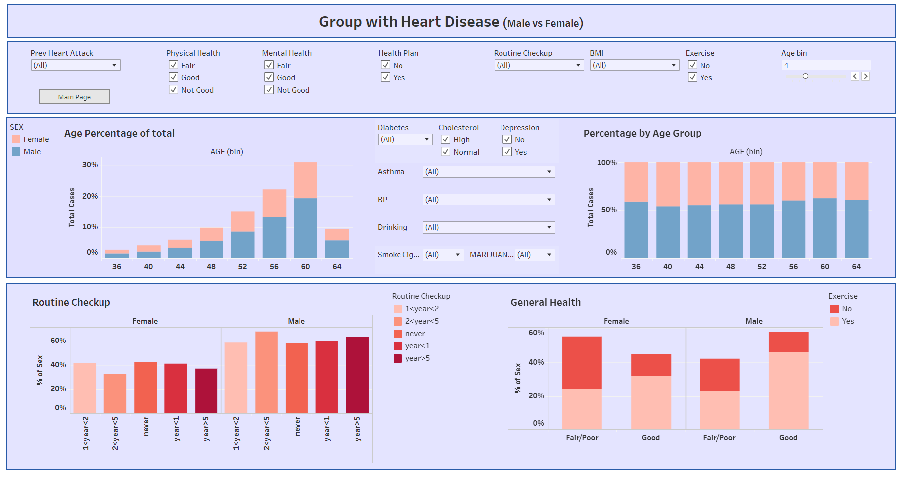

# Defense of the Heart: Predicting Heart Disease

## Introduction 
In recent years, heart disease has emerged as a major health concern worldwide. This cardiovascular condition not only poses a significant threat to individuals' well-being but also places a substantial burden on healthcare systems. To effectively address these challenges, it is crucial to gain a comprehensive understanding of the trends and correlations associated with heart disease. The objective of this project is to analyze various factors and datasets associated with cardiovascular health in order to investigate and predict underlying patterns and trends.

## Data Source, Cleaning, and Analysis
For our project, we have chosen to utilize the official website of the [Centers for Disease Control and Prevention (CDC)](https://www.cdc.gov/brfss/annual_data/annual_2021.html) as the primary source of our data. We obtained a SAS file from the CDC website, and we utilized Python for data cleaning and the creation of simplified datasets that are specifically tailored to our investigation.

One key aspect of our research focuses on the utilization of super reduced datasets, which consist of a limited number of variables. These datasets provide us with valuable insights into heart disease by examining factors such as cigarette usage, work status, and gender. By studying the relationships between these variables and the incidence of heart disease, we aim to gain a better understanding of how they interact with cardiovascular health.

## Design an Interactive DashBoard
We used Tableau to design and create our interactive dashboard. Dimensions are selected according to their correlation with the target variable(Heart Disease). Based on these particular parameters' values, the user can apply a corresponding filter. As shown in the following figures, we designed two separate pages for our dashboard. 
The Main Page includes demographic characteristics of data including *age, gender, work status, marital status, and education*. Some of the other features which correspond to health conditions like *Physical/Mental Health, Routine checkup, Cholesterol, Diabetes,..* are also available as a different set of filters. In the Main Page, the user can compare two groups which are tagged as Having Heart Disease/Not Having Heart Disease. 

The Second Page includes more detailed information of people who are having heart disease.
The user can switch between the Main and Second page using the provided buttons at the top of the page.

## Focus on Specific Behavioral Factors
We also used Tableau to visualize the impact that certain behavioral factors have on heart disease. The published Tableau story on Substance Use highlights key findings on the affects of Alcohol, Tobacco/E-Cig, and Marijuana. Non-alcohol drinkers have a slightly higher risk than alcohol drinkers to suffer from heart disease, while males over the age of 60 who are current or former smokers are roughly 2x more likely than females to be at risk for heart disease. 

https://public.tableau.com/app/profile/lucia.tablas/viz/HeartDisease_16844577019490/Story1?publish=yes

## Tableau Visualizations
[Vivian's Tableau](https://public.tableau.com/app/profile/vivian.sun1505/viz/HeartStrokevsDepression/MentalHealthDays)

[Leah's Tableau](https://public.tableau.com/app/profile/leah.krause/viz/Final_CDC_2020/HeartDiseaseTeethRemovedPie)
